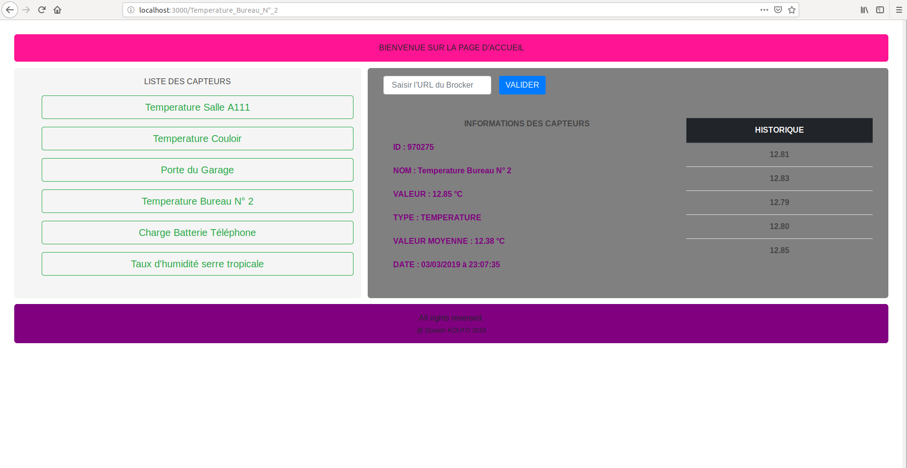

# Object Model Lab  

# React & React Router Lab

- Année : M1 IWOCS
- Matière: WEB
- TP : n°5

## Auteur(s)

|Nom|Prénom|login|email|
|--|--|--|--|
| *KOUTO* | *Dosseh* | *kd184351* | *dosseh.kouto@etu.univ-lehavre.fr* |

## Travail à réaliser

Détail du tp : <https://pigne.org/teaching/webdev1/lab/ReactRouterLab>

This project was bootstrapped with [Create React App](https://github.com/facebook/create-react-app).

 ####  Aperçue de la page d'accueil.

 

